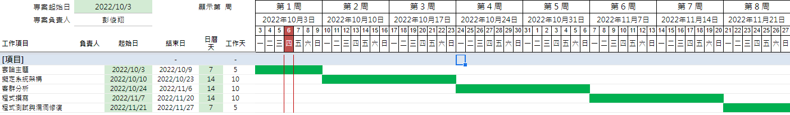
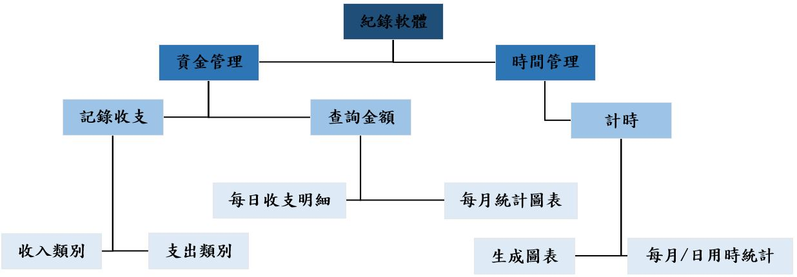

# 第16組_手機的紀錄軟體

|職稱|組員|工作內容|
|:----:|:---------------:|:---:|
| 組長 |C108118205_彭俊翔 |  -  |
| 組員 |C109118185_廖昱涵 |  -  |

---
### 甘特圖

---
### 功能性需求
> #### 1.可選擇或自訂的收支選項。
> #### 2.日統計與月統計的整合和生成圖表。
> #### 3.可記錄自己一天的時間分配。
### 非功能性需求
> #### 1.
> #### 2.
> #### 3.
---
### 功能分解圖 FDD

---
### 需求分析
> #### 1.使用者可以透過點擊來**輸入時間與消費數目**和用點擊來**紀錄持續時間**。
> #### 2.使用者可藉由讀取這些紀錄。
> #### 3.將紀錄資料**產生報表**。
> #### 4.有條列式圖表與圓餅圖。

---
### 使用案例圖

---
### 使用案例說明

---
### Figma

---
