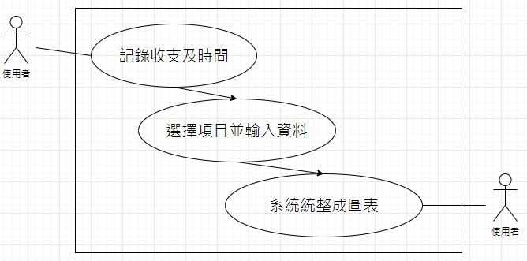
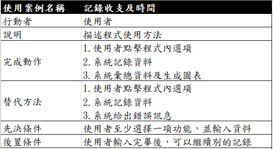

# 第16組_手機的紀錄軟體
### HOMEWORK 1
---
|職稱|組員|工作內容|
|:----:|:---------------:|:---:|
| 組長 |C108118205_彭俊翔 |撰寫計劃書、程式開發、程式測試、系統測試、使用者測試|
| 組員 |C109118185_廖昱涵 |撰寫計劃書、程式開發、程式測試、系統測試、使用者測試|

---
### 甘特圖

---
### HOMEWORK 2
---
### 功能性需求
> #### 1.可選擇或自訂的收支選項。
> #### 2.日統計與月統計的整合和生成圖表。
> #### 3.可記錄自己一天的時間分配。
### 非功能性需求
> #### 1.反應時間：使用者觸發按鍵後，0.5秒內即刻執行。
> #### 2.使用性：設計簡易版面，讓使用者能一看就理解如何操作，降低訓練時間。
> #### 3.效能：大量帳單需要記錄時，不會受到延遲或記錄錯誤。
---
### 功能分解圖 FDD

---
### 需求分析
#### 以使用者來使用這個系統的需求分析簡述：
> #### 1.使用者可以透過點擊來**輸入時間與消費數目**和用點擊來**記錄持續時間**。
> #### 2.使用者可藉由讀取這些紀錄。
> #### 3.將紀錄資料**產生報表**。
> #### 4.有條列式圖表與圓餅圖。

---
### 使用案例圖

---
### 使用案例說明

---
### Figma使用案例的動態模擬畫面
<https://www.figma.com/file/XdpyRDpNbLmgaXZKmU49xv/Untitled?node-id=1%3A3>

---
